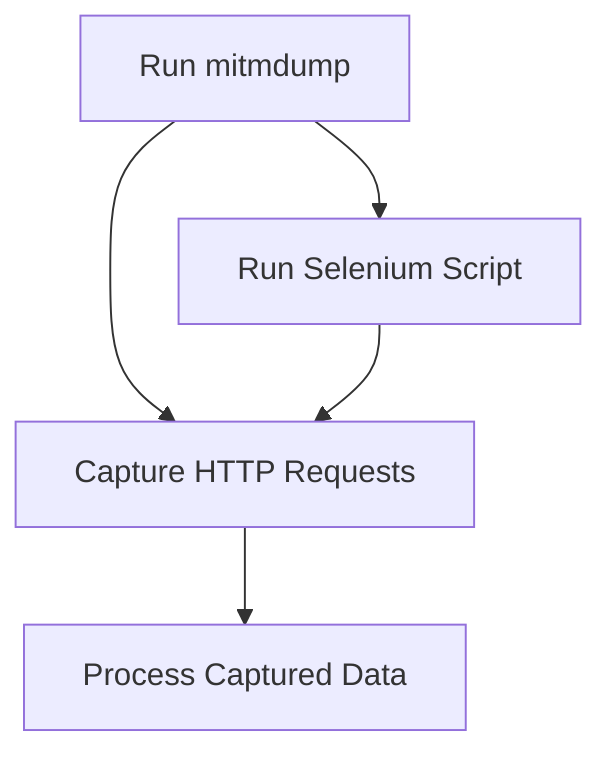
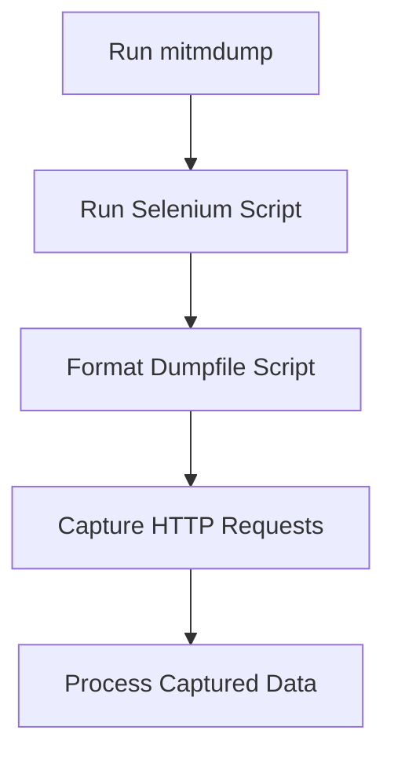
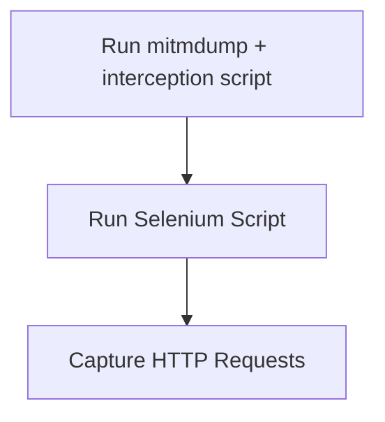

# PowerBI_Insights
Automatic insight generator from PowerBI web Reports and Dashboards
## Architecture

## Data Extraction Approaches

### Web Scraping and Interception Approach
### Option 1.1 [Selenium + mitmproxy:](https://github.com/jonruida/PowerBI_Insights/tree/main/Data_Extraction/Web_Scraping%20/Option_1.1)

- **Sources**:
  - [mimproxy doc](https://docs.mitmproxy.org/stable/)

- **Technologies/Strategies**:
  - Use Selenium for web automation and interaction
  - Use mitmproxy to intercept and capture HTTP requests

- **Status**: 
  - Discarded

- **Report**:
  - Using Selenium with Firefox browser due to proxy certificate security errors with Chrome.
  - This approach allows for capturing and interacting with web data in a less native manner, providing flexibility in data extraction.
- **Problem Solving**:
  - Not working: Use --anticomp option while using mitmdump comand [link](https://discourse.mitmproxy.org/t/get-raw-unzipped-html-when-export-using-mitmdump-w-filename-zlib/135/2)

### Option 1.2 [Selenium + mitmproxy](https://github.com/jonruida/PowerBI_Insights/tree/main/Data_Extraction/Web_Scraping/Option_1.2):

- **Sources**:
  - [Read_dumpfile github](https://github.com/YagiGo/YPTN/blob/master/io_read_dumpfile.py)

- **Technologies/Strategies**:
  - Use mitmproxy to intercept and capture HTTP requests
  - Run a script (`read_dumpfile_to_file.py`) to format the captured data
  - Process the formatted data with `gzip_readfile` script

- **Status**: 
  - Stopped

- **Report**:
  - Improves the Option 1 by standarrdizing the format, still has some issues uncompressing GZIP due to single \ being recognized as double\\.

 ### Option 1.3 [Selenium + mitmproxy:](https://github.com/jonruida/PowerBI_Insights/tree/main/Data_Extraction/Web_Scraping%20/Option_1.3)

- **Sources**:
  - [mimproxy doc](https://docs.mitmproxy.org/stable/)

- **Technologies/Strategies**:
  - Use Selenium for web automation and interaction
  - Use mitmproxy to intercept and capture HTTP requests
  - Process captured data with custom script

- **Status**: 
  - In progress

- **Report**:
  - Improves option 1.1 and option 1.2 by including a catpure script along with mitmdump running command
  - Solves data format and compression problems

### Option 2: [Python Requests](https://github.com/jonruida/PowerBI_Insights/tree/main/Data_Extraction/Web_Scraping/Option_2)

- **Sources**:
  - [Github repo](https://github.com/kulwinderkk/webscraping/blob/main/Improved%20script%20for%20PowerBI%20Webscraping.ipynb)
  - [Prefect Documentation](https://docs.prefect.io/)

- **Technologies/Strategies**:
  - Use Python with Prefect for orchestrating the ETL process
  - Scrape data from the UN Power BI dashboard using the provided script
  - Based on a payload

- **Report**:
  - Needs a custom payload for each dashboard, so it's necessary a method for create custom payloads automaticaly.
  - Trying to extract data tables structure from API.
    
- **Status**: 
  -  PENDING 

### Option 3: [Selenimum (PYPI with package)](https://github.com/jonruida/PowerBI_Insights/tree/main/Data_Extraction/Web_Scraping/Option_3/Selenimum_PYPI)

- **Sources**:
  - [PYPI](https://pypi.org/project/PBI-SELENIUM/#description)

- **Technologies/Strategies**:
  - Use PyPi library to automatize selenium.

- **Report**:
  - It needs email, password and url like previes custom option.
  - 
- **Status**: 
  
  -  NEXT PENDING 

### Native API Connectivity Approach

#### Sources:
 -  [Github Available solutions for embedding Power BI content Repo](https://github.com/microsoft/PowerBI-Developer-Samples)
 -  Get Access Token Code, [Microfost Community Forum](https://community.fabric.microsoft.com/t5/Developer/REST-API-Get-Access-Token/m-p/1895937)

### Option 1: [PowerShell Module `MicrosoftPowerBIMgmt`](https://github.com/jonruida/PowerBI_Insights/tree/main/Data_Extraction/Native_API_Con/Option_1) 
- **Sources**:
  - [Article c-sharpcorner](https://www.c-sharpcorner.com/article/install-power-bi-powershell-in-your-windows-machine/)
  - [Module doc](https://learn.microsoft.com/en-us/powershell/module/microsoftpowerbimgmt.reports/get-powerbireport?view=powerbi-ps)
- **Technologies/Strategies**:
  - Docker PowerShell container
  - Connect from container using PWSH native module
  - Get access token

- **Status**: 
  - Discarded

- **Report**:
  - Requires interaction with a browser, which is not convenient for use in an artifact. It would complicate things by needing Selenium or similar.
    
  - Requires credentials, and it seems necessary to create an [Azure App](https://learn.microsoft.com/en-us/rest/api/power-bi/) for this. Gena is developed in Azure, nayways don't know if it's possible to use its credentials. 

### Option 2: REST API Connectivity
- **Sources**:
  -[Blog Coupler](https://blog.coupler.io/power-bi-rest-api/)  
- **Technologies/Strategies**:
  - Authentication via OAuth2
  - Make HTTP requests from a Docker container

- **Status**: 
  - PENDING

- **Report**:
  - The REST API allows for more direct integration without the need for browser interaction.
  - Requires creating an application in  [Azure App](https://learn.microsoft.com/en-us/rest/api/power-bi/) to obtain access tokens.
  - The REST API documentation provides detailed examples of how to make the necessary requests.

### Option 3: DirectQuery Connectivity

- **Technologies/Strategies**:
  - Configure DirectQuery to connect directly to data sources
  - Use Power BI Desktop to configure and publish reports

- **Status**: 
  - PENDING

- **Report**:
  - Requires configuration of data sources in PowerBI.

### Option 4: Export Data
- **Sorces**:
  - [Forum](https://stackoverflow.com/questions/52079733/data-scraping-from-published-power-bi-visual)
- **Technologies/Strategies**:
  - Use the [Power BI Export Data feature](https://learn.microsoft.com/en-us/power-bi/visuals/power-bi-visualization-export-data)
  - Configure Power BI to allow data export
  - Make HTTP requests from a Docker container to export data

- **Status**: 
  - PENDING

- **Report**:
  - The Export Data feature allows you to export data from Power BI visualizations to Excel or CSV files.
  - Requires configuration of Power BI to grant export permissions.

### Option 5: Power BI in Jupyter Notebooks
- **Sources**:
  - [Jupiter Notebook Github](https://github.com/microsoft/powerbi-jupyter)
  - [PyPI](https://pypi.org/search/?q=Power+BI+report+demo.ipynb)

- **Technologies/Strategies**:
  - Use the [powerbiclient library](https://github.com/microsoft/powerbi-jupyter) to embed Power BI reports in Jupyter Notebooks
  - Authenticate using Azure AD or embed tokens
  - Export data from Power BI visuals directly within Jupyter Notebooks

- **Status**: 
  - PENDING

- **Report**:
  - Requires authentication via Azure AD or embed tokens to access Power BI reports.
  - The [documentation](https://github.com/microsoft/powerbi-jupyter/blob/main/DOCUMENTATION.md) provides detailed steps on how to install and use the library.

### Option 6: Scanner API
- **Sources**:
  - Example (https://www.dataxbi.com/blog/2021/08/23/probando-scanner-api-power-bi/)
  - [Microsoft Doc](https://learn.microsoft.com/en-us/fabric/governance/metadata-scanning-overview)
  - [PowerBI Doc](https://powerbi.microsoft.com/en-us/blog/announcing-scanner-api-admin-rest-apis-enhancements-to-include-dataset-tables-columns-measures-dax-expressions-and-mashup-queries/)
- **Technologies/Strategies**:
  - Use the Power BI Scanner API to extract metadata from Power BI workspaces
  - Authenticate using Azure AD with service principal
  - Make HTTP requests from a Docker container to scan and retrieve metadata

- **Status**: 
  - PENDING

- **Report**:
  - The Scanner API allows you to extract detailed metadata from Power BI workspaces, including datasets, reports, dashboards, and more.
  - Requires proper configuration of Power BI and Azure AD to grant the necessary permissions for scanning.

### Option 7: Datamarts
- **Sources**:
  - [Microsoft Doc](https://learn.microsoft.com/en-us/power-bi/transform-model/datamarts/datamarts-overview)
- **Technologies/Strategies**:
  - Use the Power BI Datamarts to create a fully managed SQL database for data storage and exploration
  - Ingest, transform, and load (ETL) data using Power Query
  - Define relationships and policies for business intelligence and analysis

- **Status**: 
  - PENDING

- **Report**:
  - Datamarts provide a no-code experience for data ingestion and transformation, making it easier for self-service users to perform relational database analytics.
  - Requires proper configuration to ensure data governance and performance.
  - The documentation provides detailed steps on how to set up and use Datamarts.

### Option 8: Dataflows
- **Sources**:
  - [Microsoft Doc](https://learn.microsoft.com/en-us/power-bi/transform-model/dataflows/dataflows-introduction-self-service)
- **Technologies/Strategies**:
  - Use Power BI Dataflows to create reusable transformation logic
  - Connect to various data sources and perform ETL (Extract, Transform, Load) operations
  - Store data in Azure Data Lake Gen 2 for further processing and analysis

- **Status**: 
  - PENDING

- **Report**:
  - Dataflows allow you to create a single source of truth by combining data from multiple sources and transforming it into a usable format.
  - Requires proper configuration of data sources and permissions to ensure smooth operation.

### Future Work
- (Outline any future plans or improvements)

### Contributors
- (List the contributors to the project)

### License
- (Specify the license under which the project is distributed)

